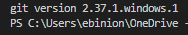
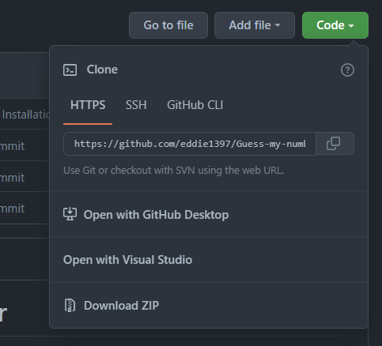
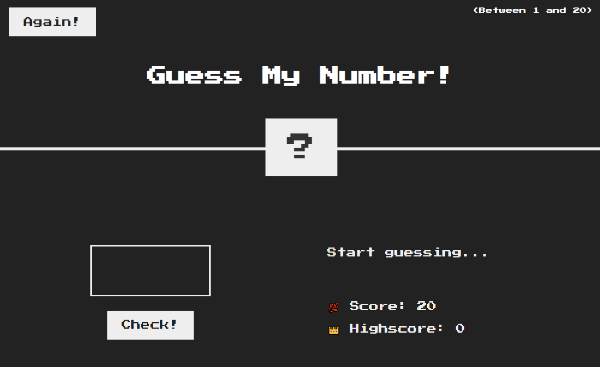

# Guess My Number

## Description:
Guess my number is a game that I created with a little bit of extra time on my hands. In this game, you do exactly what the title is saying... guessing. You will have 20 lives that will be represented by your score in the bottom right-hand corner. After every guess, you will be told whether the number was too high or too low. Continue guessing until you get the right number. Be careful though, if your score reaches 0 you will have to start completely over! If you ever want to start the game again just press the again button on the top left corner. Have FUN and Happy guessing! 

## Installation w/ Git  👨‍💻
*(Please use this method if you already have Git installed on your local computer.)*
* To check if you have Git installed use `git -v` in the terminal.
* You should see something like this.

* If you dont see a Git version, download Git [ HERE ](https://git-scm.com/downloads)

* Once you have Git installed you want to clone the site down to your local repository using the command `git clone (ssh or https key)`

* Once the project is cloned down just use `start index.html` while in the Guess My Number folder
* If the game doesnt automatically start, go to `http://localhost:3000/` in your browser.
* You should see the the starting game screen. It looks like this... 

 ## Installation without Git ( ZIP ) 
*(Please use this method if you DO NOT have Git installed on your local computer.)*
* First youre going to want to select Download ZIP in the drop down where you clone the code.

* Save the file to your local computer and extract the data.

* Once saved you can open the file in any code editor and use `start index.html` in the terminal. The result will be the same as the above game photo.

## 

